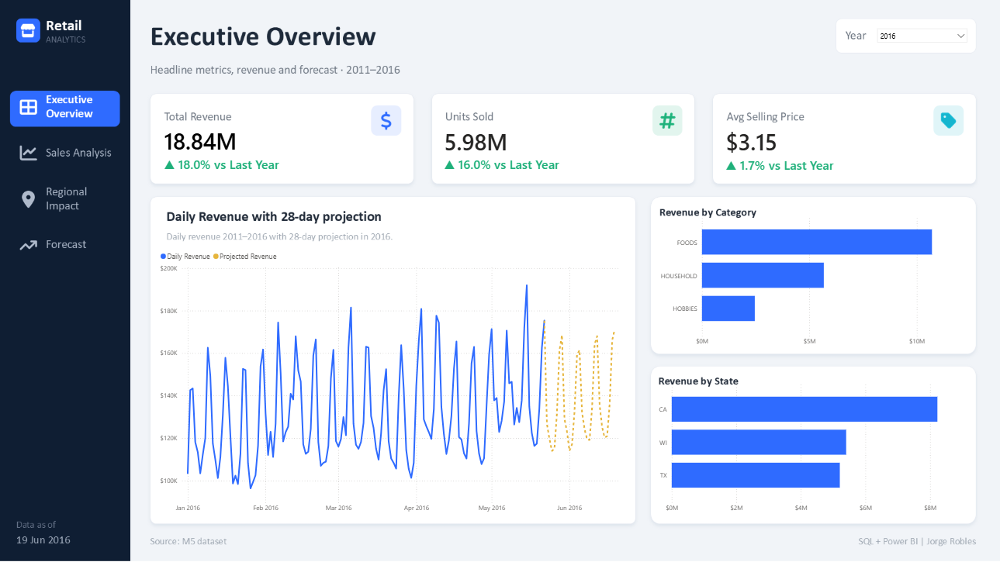
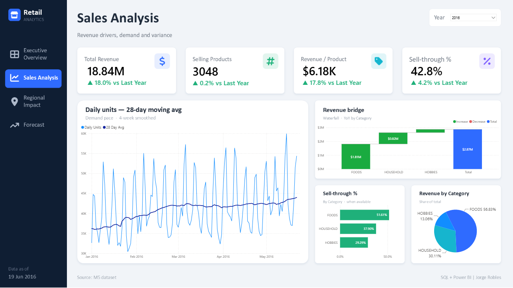
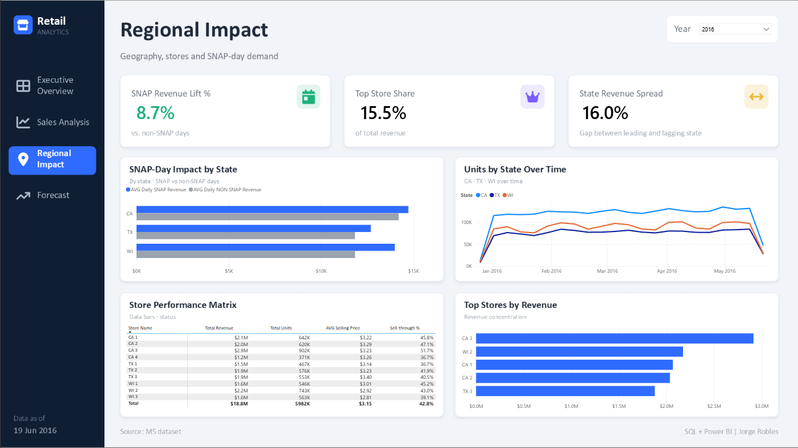
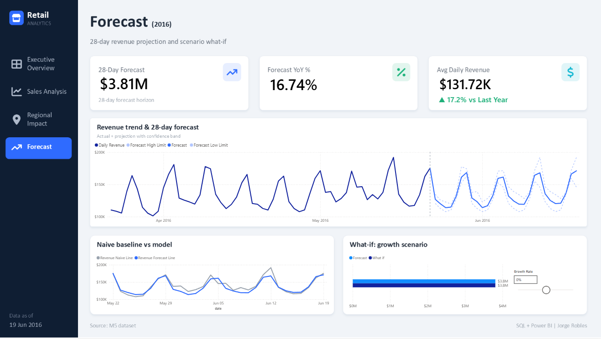

# M5 Retail Analytics: Walmart Sales with SQL Server and Power BI

End-to-end retail analytics project based on the **M5 Walmart dataset** that contains 59 million daily sales records transformed in SQL Server into a star schema, uploaded and analyzed in a 4-page report on Power BI with a custom forecast built in DAX.


*Executive Overview: Total revenue, total units sold and average price all of them with their Year-over-year change and the revenue trend.* 

**Why these results can be trusted:** The first version of the measures concluded that the sales were falling in the last year available and that SNAP days hurt the revenue. Both results looked suspicious, so instead of just accepting them, they were reviewed in depth. Both conclusions turned out to be measurement errors: the yearly comparison was matching almost 5 months of 2016 against the full year 2015 and the SNAP average was dividing by days instead of stores. When these situations were fixed the conclusions were the opposite: Sales grew 18% and SNAP days sell 8.7% more than regular days.

## Key findings 

- **Revenue grew 18%** in 2016 compared against the same period of 2015 (January 1 to May 22), driven by the volume (units sold +16%) and not by price that just grew 1.7%.

- **Where did the growth come from?** Products with sales only grew 0.2% while revenue per product grew 17.8% in 2016 so the growth came from selling more of the same products, not from adding new ones.

- **Sell-through improved** from 38.6% to 42.8%, this means that when a product was on sale it sold more often. This metric does not exist in the raw data; it was built by deriving product availability from the weekly prices.

- **On SNAP days:** the stores see an increase in their sales of 8.7% in 2016 and 11.7% in all the years that the dataset includes (2011-2016).

## Questions that the report answers

| Page | Question | 
|------|----------|
| Executive Overview | How is the business doing? |
| Sales Analysis| Why? What drives the revenue? | 
| Regional Impact | Where? How much do SNAP days affect sales? |
| Forecast | What comes next in the following 28 days? | 

## Approach

- **Dataset:** Contains real Walmart data from the M5 competition (Kaggle): 3,049 products sold in 10 stores across 3 states, with weekly prices and SNAP days. This means that there are 30,490 product-store combinations, each with 1,941 days of sales that brings a total of *59,181,090 (30,490 x 1,941) daily rows*. The volume and details of this dataset makes it perfect to execute real data engineering and analytical thinking, not just visualizations. 

- **Tools:** SQL Server + Power BI is a standard combination of tools in companies that work with Microsoft software. During the project SQL handled all the heavy and complex transformations it unpivoted a wide file, reshaped 59 million rows, joined 6.8 million prices. On the other hand Power BI focused on the model, the DAX measures and the creation of visuals to tell the story of the data. The SQL queries used on the project are in this repository and can be rerun if needed. The DAX measures are located in the .pbix file and each one contains a detailed comment about their functioning

- **Granularity:** One row per product, per store, per day. It's the lowest level available, and it is needed to detect when each product was on sale and which stores were on SNAP day or not. 

- **Forecast horizon:** 28 days were used, not just by a personal decision but because the dataset includes exactly those days after the last sale, this number of days translates into exactly 4 complete weeks, which keeps the weekly sales rhythm intact.

- **Planning and refinement:** The foundation of the project was defined even before the building started: the question of each page, the grain, the use of the star schema and how the zero's would be handled. While the construction of the project was being executed, the first version of the project was refined, pages that overlapped were merged into one, unused columns were removed and every key result was verified against the data.

## Report Pages

*Note: All the pages are set in 2016*

### Executive Overview
The landing page: How the business is doing at a glance. (Shown at the top of this page)

### Sales Analysis 
Explains what drives the revenue: categories, demand trend and sell-through. 


### Regional Impact
Compares states and stores, measures the effects of the SNAP days on the revenue.


### Forecast
Projects how the next 28 days will act with a confidence band and a growth scenario.


## How it was built

1. **Load:** The three source files were loaded into SQL Server in two different ways:
    - `sales_train_evaluation.csv` has 1,947 columns, more than the 1,024 allowed by a SQL Server table so each line was loaded as text with `BULK INSERT`.
    - `calendar.csv` and `sell_prices.csv` were loaded with the SSMS Import Wizard.

2. **Transformation:** `STRING_SPLIT` turned 30,490 wide lines into 59,181,090 daily rows. 

3. **Model:** A star schema with one fact table `FactSales` (daily sales), and three dimension tables: `DimProduct` (products), `DimStore` (stores) and `DimDate` (calendar), each with their respective primary keys.

4. **Availability and revenue:** Weekly prices identify when each product was on sale, and revenue is stored as a `PERSISTED` column.

5. **Power BI:** DAX measures, year-over-year comparisons and a custom 28-day forecast.

See details on: [data model](docs/data_model.md) - [DAX measures](docs/dax_measures.md) - [Design decisions](docs/design_decisions.md) - [SQL scripts](sql/)

## Repository structure

```
M5_Retail_Analytics/
├── sql/                    SQL Server pipeline, queries 01 to 06 in execution order
├── powerbi/                Power BI report (.pbix file)
├── docs/                   Data model, DAX measures and design decisions
└── images/             
    ├── preview/            Screenshots of the report pages situated in 2016
    └── background_images/  Page backgrounds designed for the report
```

## Development tools

- SQL Server Management Studio 22 (SSMS)
- Visual Studio Code + mssql extension
- Power BI Desktop

## How to reproduce

**To explore the report only:** Open `powerbi/m5_retail_analytics.pbix` in Power BI Desktop (free Microsoft software). The data is imported in the file, so there is no need for the database.

**To rebuild everything from scratch:**
1. Download the source files from [Kaggle](https://www.kaggle.com/competitions/m5-forecasting-accuracy/data).
2. Run `sql/01_setup.sql` in SQL Server 2025 (The query sets the compatibility level at 170).
3. Import `calendar.csv` into `bi.DimDate` and `sell_prices.csv` into `pre.Prices` with the SSMS Import Wizard.
4. Run the queries from `02` to the `06` in order, updating the CSV path in `02_load_raw_sales.sql`.
5. Open the `.pbix` file and point it to your own SQL Server. *Home → Transform → Data Data source settings → Change Source* and replace `Jorge-PC\SQLEXPRESS` with the name of your server and click *Refresh*.

## Author

**Jorge Robles** · Querétaro, Mexico · [LinkedIn](https://www.linkedin.com/in/jorge-robles-data)