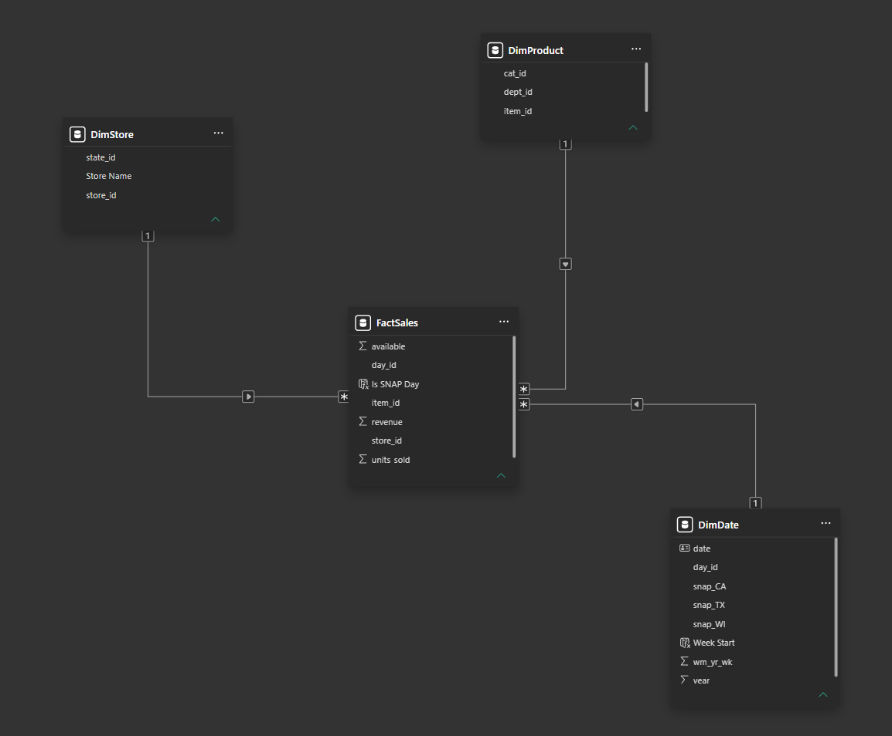

# Data Model

## Source data: ([M5 Forecasting - Accuracy, Kaggle](https://www.kaggle.com/competitions/m5-forecasting-accuracy/data))

To download the files, you need to sign up in Kaggle.

|          File name           |     Rows     |                           Granularity                                |      
|------------------------------|--------------|----------------------------------------------------------------------|  
| `sales_train_evaluation.csv` |    30,490    | One row per item-store, wide format (1,941 day columns(d_1,d_2,...)) |
|      `sell_prices.csv`       |  6,841,121   | One row per item-store-week                                          |
|       `calendar.csv`         |     1,969    | One row  per day (2011/01/29 - 2016/06/19)                           |

The calendar continues 28 days after `d_1941` (last day with sales). These extra days are the forecast horizon.

## Star-schema

|    Table     |     Type     |     Rows     |                          Key Columns                                       |
|--------------|--------------|--------------|----------------------------------------------------------------------------|   
| `FactSales`  |     Fact     |  59,181,090  | 'item_id','store_id', 'day_id', 'units_sold', 'available', 'revenue'       |
| `DimProduct` |   Dimension  |     3,049    | 'item_id' (PK), 'dept_id', 'cat_id'                                        |
| `DimStore`   |   Dimension  |      10      | 'store_id' (PK), 'state_id'                                                |
| `DimDate`    |   Dimension  |     1,969    | 'day_id' (PK), 'date', 'wm_yr_wk', 'year', 'snap_CA', 'snap_TX', 'snap_WI' |

**PK = Primary Key**

**Grain of the FactSales table:** One row per product, per store, per day.

**Relationships:** one-to-many, single direction, from each dimension table to the fact table.

## Zero handling

64% of the daily sales values are zero, these zeros can mean two things:
1. The product was on sale but didn't generate any sale
2. Or the product wasn't on sale yet. 

Note: `FactSales` gets each day's week from `DimDate` and then its price by product, store and week. Prices only exist for weeks on sale.

- Price found that week marks `available = 1` so is on sale.
- No price marks `available = 0` so is not on sale yet

This method also shows when a product is removed from sale and later reintroduced so those weeks are not counted as days without sales.

**Rule applied to the measures:**
- **Sums** (Units Sold or Revenue) don't get affected by the availability of the products because if it's not available it will not increase
- **Average, percentage and counts** need to apply a filter with `available`, so inactive days don't inflate the denominator

## Revenue

`revenue` is a `PERSISTED` computed column in SQL (`units_sold * prices`)
It's only calculated in SQL and Power BI only reads it, to optimize performance, when there is no price, revenue is NULL, so it 
doesn't affect totals. 

## Model optimization 

During the build of this project all the columns that live in SQL were imported to Power BI, because it wasn't clear the path that the report
would follow. 

Once the report came to an end, every column was reviewed against the measures, visuals and relationships. Those that weren't used in the final report, were removed from the .pbix file reducing the size of the file by 26.3 MB. The columns remain in SQL so they can be used later or if the project needs to be modified. 

See the **sql/** folder for the full pipeline.  